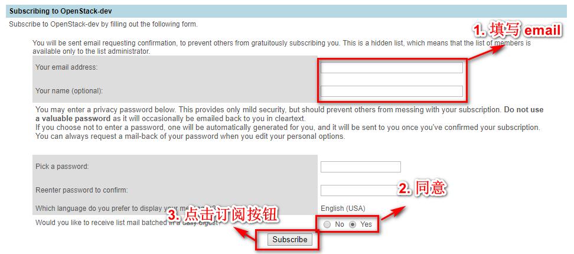
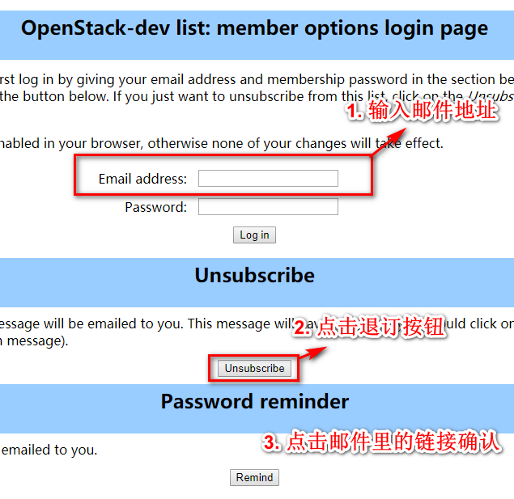

# 网站介绍

* [launchpad](https://launchpad.net/openstack) lanuchpad 主要是社区用来记录 bug 和 bp 的地方;
* [openstack](https://www.openstack.org/) openstack 的官方网站;
* [gerrit](https://review.openstack.org) 下载代码，评审;

<!-- more -->

# 前期准备

* 注册 [launchpad](https://launchpad.net/openstack) 帐号;
* 注册 [openstack](https://www.openstack.org/profile) 帐号;
    - 登录 https://review.openstack.org;
    - 进入 https://review.openstack.org/#/settings/ 在里面填写如下信息：
        - 在Profile中的Username
        - 在Agreements中签署协议（个人是ICLA)
        - 在Contact Infomation中填写所有内容，注意如果之前不是Foundation Member就会出现无法提交问题
        - 在HTTP Password中Generate Password，生成一串代码。后续提交代码时需要用到这串密码


# 提交代码

在提交代码之前我们需要做一些简单的配置。

## git review安装

```python
pip install git-review
```


## git 配置

```shell
# 这里的名字必须是gerrit的名字
git config gitreview.username <your name>

# ssh用不了，使用https方式提交
git config gitreview.scheme https
git config gitreview.port 443

git review -s -v
```

## 提交代码

```shell
git add --all
git commit -m "commit msg"

git review
```

如果已经 commit 完了，发现还有代码需要修改，我们需要追加 commit.

```shell
# 可以编辑 commit 信息
git commit --amend
```

## 邮件列表

### 订阅

直接访问 [Mailing list](http://lists.openstack.org/cgi-bin/mailman/listinfo/openstack-dev)



### 退订

如果感觉邮件列表太多，可以退订邮件列表：

http://lists.openstack.org/cgi-bin/mailman/options/openstack-dev

