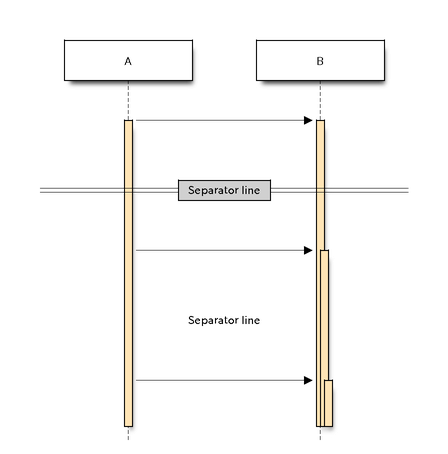
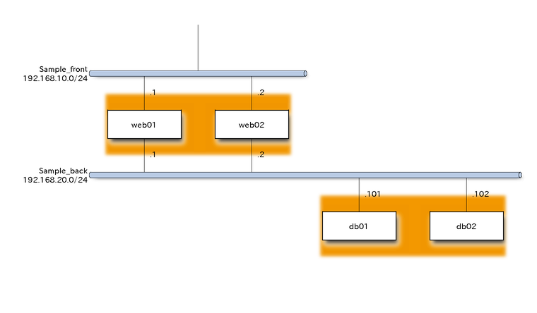

在我们写文档的时候常常需要插入一些图片来辅助说明，文档可以用 git 来管理，换个人很容易修改，但是图片如果没有原图很难修改。这里我们介绍几款代码画图工具，可以很方便的用 git 管理。

<!-- more -->

## plantuml

看名字就知道这个工具是用来画 uml 图的。 plantuml 在国外使用比较广泛，很多 web 工具都支持 plantuml.

plantuml 支持以下几种类型的 uml 图：

* Sequence diagram
* Usecase diagram
* Class diagram
* Activity diagram
* Component diagram
* State diagram
* Object diagram
* Deployment diagram
* Timing diagram

plantuml 也支持几种非 uml 的图，具体如下：

* Wireframe graphical interface
* Archimate diagram
* Specification and Description Language (SDL)
* Ditaa diagram
* Gantt diagram
* Mathematic with AsciiMath or JLaTeXMath notation

### 使用方法

#### Sequence diagram

基本用法

```
@startuml
Alice -> Bob: Authentication Request
Bob --> Alice: Authentication Response

Alice -> Bob: Another authentication Request
Alice <-- Bob: another authentication Response
@enduml
```

声明参与者


```
@startuml
actor Foo1
boundary Foo2
control Foo3
entity Foo4
database Foo5
collections Foo6
Foo1 -> Foo2 : To boundary
Foo1 -> Foo3 : To control
Foo1 -> Foo4 : To entity
Foo1 -> Foo5 : To database
Foo1 -> Foo6 : To collections

@enduml
```


添加注释

```
@startuml
Alice->Bob : hello
note left: this is a first note

Bob->Alice : ok
note right: this is another note

Bob->Bob : I am thinking
note left
    a note
    can also be defined
    on several lines
end note
@enduml
```


#### Usecase diagram

```
@startuml
:Main Admin: as Admin
(Use the application) as (Use)

User -> (Start)
User --> (Use)

Admin ---> (Use)

note right of Admin : This is an example.

note right of (Use)
  A note can also
  be on several lines
end note

note "This note is connected\nto several objects." as N2
(Start) .. N2
N2 .. (Use)
@enduml
```


#### Class diagram

```
@startuml
Class01 <|-- Class02
Class03 *-- Class04
Class05 o-- Class06
Class07 .. Class08
Class09 -- Class10
@enduml
```


```
@startuml
Class11 <|.. Class12
Class13 --> Class14
Class15 ..> Class16
Class17 ..|> Class18
Class19 <--* Class20
@enduml
```


```
@startuml
Class21 #-- Class22
Class23 x-- Class24
Class25 }-- Class26
Class27 +-- Class28
Class29 ^-- Class30
@enduml
```


指定关系

```
@startuml

Class01 "1" *-- "many" Class02 : contains

Class03 o-- Class04 : aggregation

Class05 --> "1" Class06

@enduml
```


属性类型

```
@startuml

class Dummy {
 -field1
 #field2
 ~method1()
 +method2()
}
```


#### Activity diagram


```
@startuml

start

if (multiprocessor?) then (yes)
  fork
    :Treatment 1;
  fork again
    :Treatment 2;
  end fork
else (monoproc)
  :Treatment 1;
  :Treatment 2;
endif

@enduml
```


#### State diagram

```
@startuml
scale 600 width

[*] -> State1
State1 --> State2 : Succeeded
State1 --> [*] : Aborted
State2 --> State3 : Succeeded
State2 --> [*] : Aborted
state State3 {
  state "Accumulate Enough Data\nLong State Name" as long1
  long1 : Just a test
  [*] --> long1
  long1 --> long1 : New Data
  long1 --> ProcessData : Enough Data
}
State3 --> State3 : Failed
State3 --> [*] : Succeeded / Save Result
State3 --> [*] : Aborted
 
@enduml
```


#### Object diagram

```
@startuml
object Object01
object Object02
object Object03
object Object04
object Object05
object Object06
object Object07
object Object08

Object01 <|-- Object02
Object03 *-- Object04
Object05 o-- "4" Object06
Object07 .. Object08 : some labels
@enduml
```


#### Deployment diagram

支持类型

```
@startuml
actor actor
agent agent
artifact artifact
boundary boundary
card card
cloud cloud
component component
control control
database database
entity entity
file file
folder folder
frame frame
interface  interface
node node
package package
queue queue
stack stack
rectangle rectangle
storage storage
usecase usecase
@enduml
```


```
@startuml

node node1
node node2
node node3
node node4
node node5
node1 -- node2
node1 .. node3
node1 ~~ node4
node1 == node5

@enduml
```


#### Timing diagram

```
@startuml
robust "DNS Resolver" as DNS
robust "Web Browser" as WB
concise "Web User" as WU

@0
WU is Idle
WB is Idle
DNS is Idle

@+100
WU -> WB : URL
WU is Waiting
WB is Processing

@+200
WB is Waiting
WB -> DNS@+50 : Resolve URL

@+100
DNS is Processing

@+300
DNS is Idle
@enduml
```


#### Wireframe graphical interface

```
@startsalt
{+
{* File | Edit | Source | Refactor 
 Refactor | New | Open File | - | Close | Close All }
{/ General | Fullscreen | Behavior | Saving }
{
    { Open image in: | ^Smart Mode^ }
    [X] Smooth images when zoomed
    [X] Confirm image deletion
    [ ] Show hidden images 
}
[Close]
}
@endsalt
```


#### Archimate diagram

```
@startuml

sprite $bProcess jar:archimate/business-process
sprite $aService jar:archimate/application-service
sprite $aComponent jar:archimate/application-component

archimate #Business "Handle claim"  as HC <<business-process>>
archimate #Business "Capture Information"  as CI <<business-process>>
archimate #Business "Notify\nAdditional Stakeholders" as NAS <<business-process>>
archimate #Business "Validate" as V <<business-process>>
archimate #Business "Investigate" as I <<business-process>>
archimate #Business "Pay" as P <<business-process>>

HC *-down- CI
HC *-down- NAS
HC *-down- V
HC *-down- I
HC *-down- P

CI -right->> NAS
NAS -right->> V
V -right->> I
I -right->> P

archimate #APPLICATION "Scanning" as scanning <<application-service>>
archimate #APPLICATION "Customer admnistration" as customerAdministration <<application-service>>
archimate #APPLICATION "Claims admnistration" as claimsAdministration <<application-service>>
archimate #APPLICATION Printing  <<application-service>>
archimate #APPLICATION Payment  <<application-service>>

scanning -up-> CI
customerAdministration  -up-> CI
claimsAdministration -up-> NAS
claimsAdministration -up-> V
claimsAdministration -up-> I
Payment -up-> P

Printing -up-> V
Printing -up-> P

archimate #APPLICATION "Document\nManagement\nSystem" as DMS <<application-component>>
archimate #APPLICATION "General\nCRM\nSystem" as CRM <<application-component>>
archimate #APPLICATION "Home & Away\nPolicy\nAdministration" as HAPA <<application-component>>
archimate #APPLICATION "Home & Away\nFinancial\nAdministration" as HFPA <<application-component>>

DMS .up.|> scanning
DMS .up.|> Printing
CRM .up.|> customerAdministration
HAPA .up.|> claimsAdministration
HFPA .up.|> Payment

legend left
Example from the "Archisurance case study" (OpenGroup).
See 
==
<$bProcess> :business process
==
<$aService> : application service
==
<$aComponent> : appplication component
endlegend

@enduml
```


#### Specification and Description Language (SDL)

也是活动图

```
@startuml

start

if (multiprocessor?) then (yes)
  fork
    :Treatment 1;
  fork again
    :Treatment 2;
  end fork
else (monoproc)
  :Treatment 1;
  :Treatment 2;
endif

@enduml
```


#### Ditaa diagram

```
@startditaa
+--------+   +-------+    +-------+
|        +---+ ditaa +--> |       |
|  Text  |   +-------+    |diagram|
|Document|   |!magic!|    |       |
|     {d}|   |       |    |       |
+---+----+   +-------+    +-------+
    :                         ^
    |       Lots of work      |
    +-------------------------+
@endditaa
```


#### Gantt diagram

```
@startgantt
project starts the 2018/04/09
saturday are closed
sunday are closed
2018/05/01 is closed
2018/04/17 to 2018/04/19 is closed
[Prototype design] lasts 14 days
[Test prototype] lasts 4 days
[Test prototype] starts at [Prototype design]'s end
[Prototype design] is colored in Fuchsia/FireBrick 
[Test prototype] is colored in GreenYellow/Green 
@endgantt
```


#### Mathematic with AsciiMath or JLaTeXMath notation

```
@startuml
:<math>int_0^1f(x)dx</math>;
:<math>x^2+y_1+z_12^34</math>;
note right
Try also
<math>d/dxf(x)=lim_(h->0)(f(x+h)-f(x))/h</math>
<latex>P(y|\mathbf{x}) \mbox{ or } f(\mathbf{x})+\epsilon</latex>
end note
@enduml
```

```puml
@startuml
:<math>int_0^1f(x)dx</math>;
:<math>x^2+y_1+z_12^34</math>;
note right
Try also
<math>d/dxf(x)=lim_(h->0)(f(x+h)-f(x))/h</math>
<latex>P(y|\mathbf{x}) \mbox{ or } f(\mathbf{x})+\epsilon</latex>
end note
@enduml
```

## python 画图工具

python 也提供了几个画图工具，如果使用 sphinx 编写文档，可以直接把代码嵌套到文档中。

* [blockdiag](http://blockdiag.com/en/)
* [seqdiag](http://blockdiag.com/en/seqdiag/index.html)
* [actdiag](http://blockdiag.com/en/actdiag/index.html)
* [nwdiag](http://blockdiag.com/en/nwdiag/index.html)

### 安装

```shell
pip install blockdiag
pip install seqdiag
pip install actdiag
pip install nwdiag
```


### 简单使用

生成图片一般用指定命令接文件名即可：

```code
blockdiag test.diag
```

#### blockdiag

```
blockdiag {
   orientation = portrait

   A -> B -> C;
        B -> D;
}
```


blockdiag 可以设置很多属性，例如图片类型，颜色，大小，特效等。

```
blockdiag {
   // Set stacked to nodes.
   stacked [stacked];
   ellipse [shape = "ellipse", stacked];

   stacked -> ellipse;
}
```


```
blockdiag {
   A -> B [label='text', fontsize=16];
}
```


#### seqdiag

seqdiag 用来画时序图：

```
seqdiag {
  browser  -> webserver [label = "GET /index.html"];
  browser <-- webserver;
  browser  -> webserver [label = "POST /blog/comment"];
              webserver  -> database [label = "INSERT comment"];
              webserver <-- database;
  browser <-- webserver;
}
```


```
seqdiag {
  A -> B;

  // Separator
  === Separator line ===

  A -> B;

  // Delay separator
  ... Separator line ...

  A -> B;
}
```



```
seqdiag {
  // Use note (put note on rightside)
  browser -> webserver [note = "request\nGET /"];
  browser <- webserver;

  // Use leftnote and rightnote
  browser -> webserver [leftnote = "send request"];
  browser <- webserver [rightnote = "send response"];
}
```


#### actdiag

actdiag 用来画活动图：

```
actdiag {
  write -> convert -> image

  lane user {
     label = "User"
     write [label = "Writing reST"];
     image [label = "Get diagram IMAGE"];
  }
  lane actdiag {
     convert [label = "Convert reST to Image"];
  }
}
```


#### nwdiag

nwdiag 主要用来画网络连线图，报文结构等。

普通网络图：

```
nwdiag {
  network dmz {
      address = "210.x.x.x/24"

      web01 [address = "210.x.x.1"];
      web02 [address = "210.x.x.2"];
  }
  network internal {
      address = "172.x.x.x/24";

      web01 [address = "172.x.x.1"];
      web02 [address = "172.x.x.2"];
      db01;
      db02;
  }
}
```


指定多个 ip:

```
nwdiag {
  network dmz {
      address = "210.x.x.x/24"

      // set multiple addresses (using comma)
      web01 [address = "210.x.x.1, 210.x.x.20"];
      web02 [address = "210.x.x.2"];
  }
  network internal {
      address = "172.x.x.x/24";

      web01 [address = "172.x.x.1"];
      web02 [address = "172.x.x.2"];
      db01;
      db02;
  }
}
```


分组

```
nwdiag {
  network Sample_front {
    address = "192.168.10.0/24";

    // define group
    group web {
      web01 [address = ".1"];
      web02 [address = ".2"];
    }
  }
  network Sample_back {
    address = "192.168.20.0/24";
    web01 [address = ".1"];
    web02 [address = ".2"];
    db01 [address = ".101"];
    db02 [address = ".102"];

    // define network using defined nodes
    group db {
      db01;
      db02;
    }
  }
}
```



peer networks

```
nwdiag {
  inet [shape = cloud];
  inet -- router;

  network {
    router;
    web01;
    web02;
  }
}
```


```
rackdiag {
  // define height of rack
  16U;

  // define rack items
  1: UPS [2U];
  3: DB Server
  4: Web Server 1  // put 2 units to rack-level 4
  4: Web Server 2
  5: Web Server 3
  5: Web Server 4
  7: Load Balancer
  8: L3 Switch
}
```


多个

```
rackdiag {
  // define 1st rack
  rack {
    16U;

    // define rack items
    1: UPS [2U];
    3: DB Server
    4: Web Server
    5: Web Server
    6: Web Server
    7: Load Balancer
    8: L3 Switch
  }

  // define 2nd rack
  rack {
    12U;

    // define rack items
    1: UPS [2U];
    3: DB Server
    4: Web Server
    5: Web Server
    6: Web Server
    7: Load Balancer
    8: L3 Switch
  }
}
```


TCP 报文结构

```
{
  colwidth = 32
  node_height = 72

  0-15: Source Port
  16-31: Destination Port
  32-63: Sequence Number
  64-95: Acknowledgment Number
  96-99: Data Offset
  100-105: Reserved
  106: URG
  107: ACK
  108: PSH
  109: RST
  110: SYN
  111: FIN
  112-127: Window
  128-143: Checksum
  144-159: Urgent Pointer
  160-191: (Options and Padding)
  192-223: data [colheight = 3]
}
```

